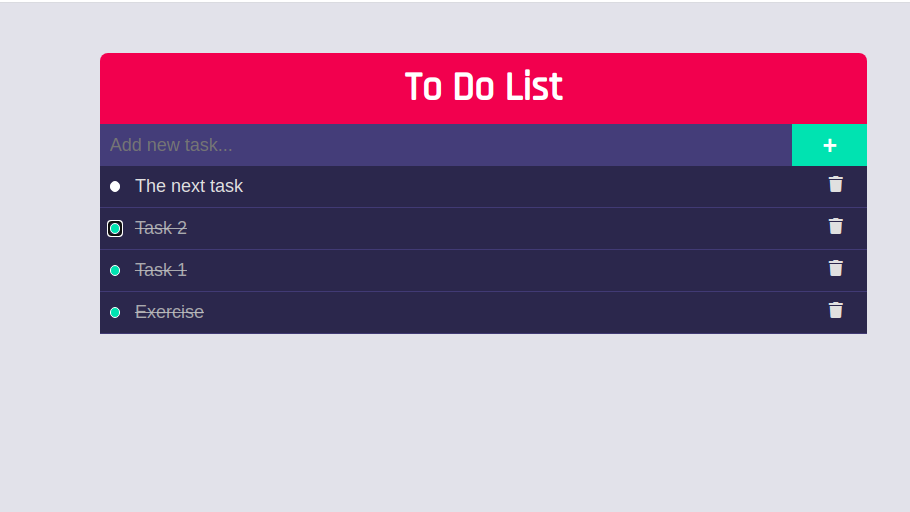

# t-odo-list
version-2

it has 3 functions:
- to add new task;
- to mark task as complete;
- to remove the completed task

(TutorialsTonight)[https://www.tutorialstonight.com/to-do-list-javascript.php?fbclid=IwAR0xJ-5GZD7fCHNLwrgzXlphp0Va5T3Oe4RHTAshGTRQDT13OqgrYwZgJAg]